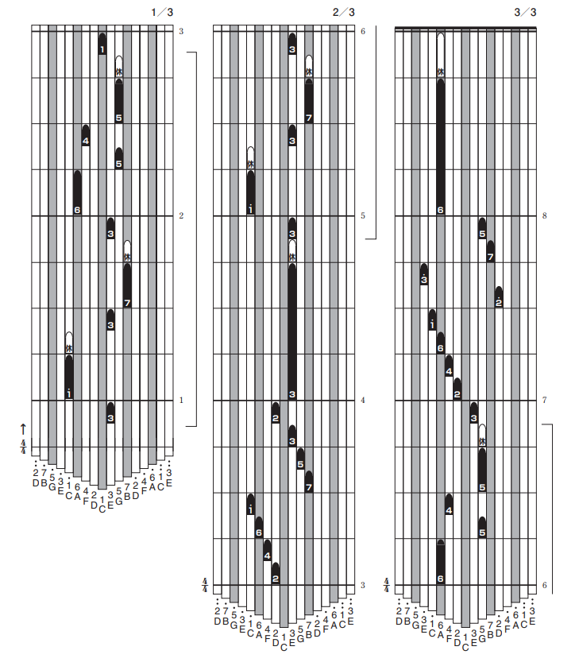

# カリンバの楽譜確認 & 編集 ツール

ウェブ上でカリンバの専用楽譜を見ることができる。
カリンバの譜面はYAMAHAのプリント楽譜のスタイルを利用する。
（メールにて公式の許諾があることを明記しなければ使って良いといわれた）

## 必要要件

v0.5条件
・17音カリンバの縦型譜面が表示出来る
・縦型譜面のままのエディター、もしくは5線譜のエディター

v1条件
・カリンバは半音に対応しないので、半音付きの楽譜をスケールを調整して
　半音無しにする機能。スケールに応じて変えれば基本はうまく行く。
・Web上で誰でも使うことが出来る事。
・広告を入れる
・楽譜の管理単位：曲ごとの保存・読込、ユーザーごとの管理、共有リンク
・編集は一旦 Undo/Redo のみで。
・入力方式は手入力。スマホでも同様に操作させたい為
・エクスポートは pdf か jpg
・対応ブラウザは PC タブレット スマホ
・アカウント機能は一旦無し
・著作権管理は一旦無視。ユーザーに委ねる。

縦型譜面のイメージはコレ

v2条件
・21音カリンバ譜面にも対応